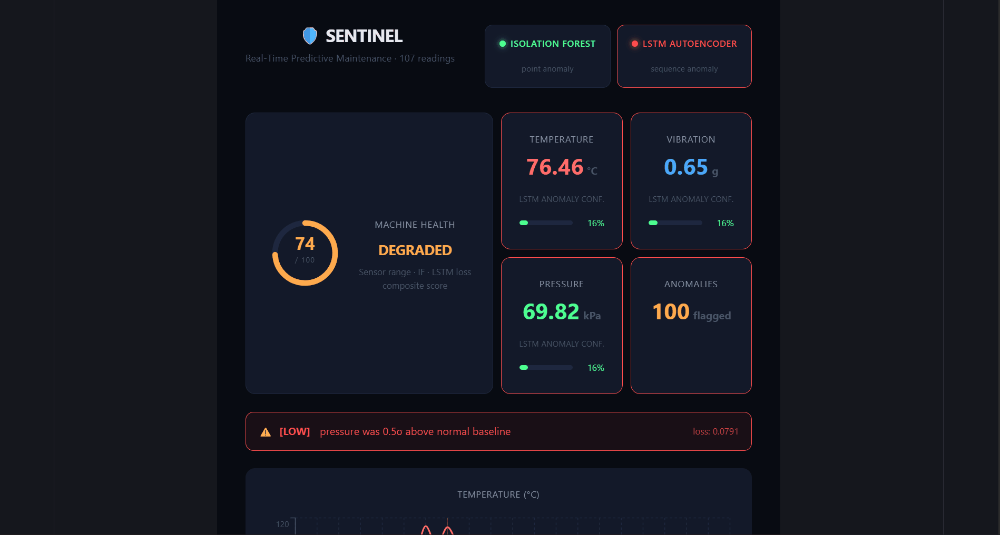

# 🛡️ SENTINEL
### Real-Time Predictive Maintenance System

> Industrial machines fail without warning — costing billions in unplanned downtime annually. SENTINEL monitors sensor streams in real-time, runs a dual ML engine (IsolationForest + LSTM Autoencoder) to detect both sudden spikes and gradual drift, and explains failure causes using statistical deviation analysis.

---

## 🔥 Live Demo
- **Dashboard:** https://sentinel-three-lyart.vercel.app
- **API:** https://sentinel-production-4d8e.up.railway.app

## Demo GIF


---

## 💡 Why This Matters

Unplanned equipment failure costs the manufacturing industry over $50B per year. Traditional threshold-based alarms miss gradual degradation — a bearing that slowly heats up over hours before catastrophic failure. SENTINEL combines a fast point-anomaly detector (IsolationForest) with a sequence-aware LSTM Autoencoder to catch both failure modes, assign severity, and pinpoint the root cause sensor — the same architecture used in real industrial condition monitoring systems.

---

## 🧠 System Architecture

```
Sensor Simulation (Gaussian noise + 5% spike injection)
        ↓
FastAPI Backend (Railway) — stores readings to SQLite
        ↓
 ┌──────────────────────────────────┐
 │         Dual ML Engine           │
 │  IsolationForest  │  LSTM AE     │
 │  (point anomaly)  │  (sequence)  │
 └──────────────────────────────────┘
        ↓                ↓
   IF flag          reconstruction loss
        ↘              ↙
       Ensemble Severity Score
       LOW → HIGH → CRITICAL
        ↓
   /explain → z-score root cause
        ↓
React Dashboard (Vercel) — live charts, health ring, anomaly log
```

---

## 🤖 ML Pipeline

### IsolationForest
- Trained incrementally on all readings in DB
- Detects **point anomalies** — single readings outside the normal distribution
- Fast, no history required

### LSTM Autoencoder
- Trained on 2000+ realistic Gaussian sensor readings
- Input: sequences of 10 consecutive readings (temperature, vibration, pressure)
- Learns to reconstruct normal patterns; flags deviations via **reconstruction loss**
- Catches **gradual failures and temporal drift** that point-based models miss
- Threshold: `loss > 0.05` → anomaly

### Ensemble Severity
| Severity | Condition |
|----------|-----------|
| LOW | One model flagging, loss < 0.15 |
| HIGH | One model flagging, loss ≥ 0.15 |
| CRITICAL | Both IF + LSTM agree simultaneously |

CRITICAL events apply an additional −20 penalty to the composite health score.

### Explainability — `/explain`
On every anomaly, SENTINEL computes z-scores across all three sensors against known baselines and identifies the primary failure cause:
```json
{
  "primary_cause": "temperature",
  "z_score": 3.2,
  "explanation": "temperature was 3.2σ above normal baseline",
  "all_deviations": {
    "temperature": 3.2,
    "vibration": 0.4,
    "pressure": -0.1
  }
}
```

---

## 📊 Dashboard — v0.5

- **Composite health ring** (0–100) — weighted combination of sensor range, IF flag, and LSTM reconstruction loss
- **Dual model status indicators** — live green/red for each model independently
- **LSTM reconstruction loss chart** — purple time-series with threshold reference line
- **Severity-tagged anomaly log** — LOW / HIGH / CRITICAL badges per event with per-sensor values and reconstruction loss
- **Pulsing CRITICAL banner** — animated alert when both models agree, with live loss readout
- **Red reference lines** on sensor charts at anomaly timestamps

---

## 🛠️ Tech Stack

| Layer | Technology |
|-------|-----------|
| Backend | FastAPI, Python |
| Database | SQLite + SQLAlchemy |
| ML | scikit-learn (IsolationForest), TensorFlow/Keras (LSTM AE), MinMaxScaler |
| Frontend | React, Recharts |
| Deployment | Railway (API + ML), Vercel (Dashboard) |

---

## 🚀 Run Locally

```bash
# Backend
pip install -r requirements.txt
uvicorn main:app --reload

# Seed DB and train LSTM (first time)
curl http://localhost:8000/seed
curl http://localhost:8000/retrain

# Frontend
cd dashboard
npm install
npm run dev
```

---

## 📡 API Reference

| Endpoint | Description |
|----------|-------------|
| `GET /sensor-data` | Generate + store new reading, run IF detection |
| `GET /predict/lstm` | Run LSTM on last 10 readings, return reconstruction loss |
| `GET /explain` | Z-score deviation analysis, identifies primary failure cause |
| `GET /retrain` | Retrain LSTM on all readings in DB |
| `GET /seed` | Seed 2000 realistic normal readings for LSTM training |

---

## 📍 Roadmap

- [x] Live sensor data API with realistic Gaussian simulation
- [x] IsolationForest point anomaly detection
- [x] LSTM Autoencoder sequence anomaly detection
- [x] Dual-model ensemble severity scoring (LOW / HIGH / CRITICAL)
- [x] Composite health score (0–100)
- [x] Z-score explainability endpoint
- [x] Cloud deployment (Railway + Vercel)
- [ ] Wire `/explain` output into live dashboard banner
- [ ] Anomaly rate trend chart (degradation over time)
- [ ] Export anomaly log as CSV
- [ ] Persistent storage via Railway Volume (SQLite survival across redeploys)
- [ ] ESP32 hardware integration
- [ ] Edge deployment (Raspberry Pi / STM32)

---

*Built by Sehaj Modi · B.Tech Instrumentation & Control Engineering, NIT Jalandhar · SENTINEL v0.5*