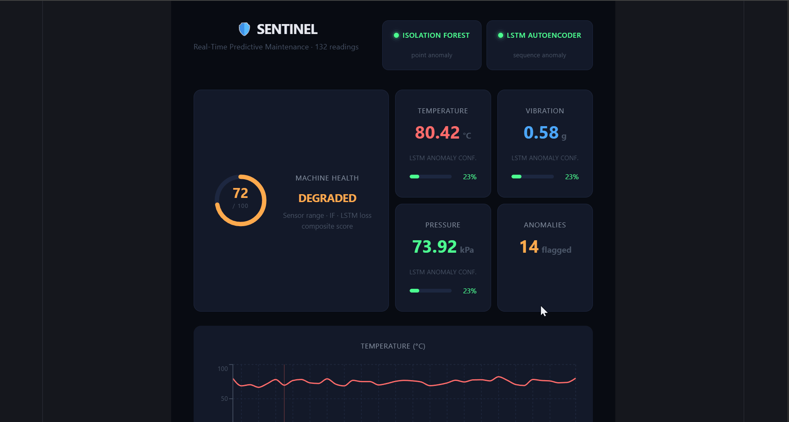

# 🛡️ SENTINEL
### Real-Time Predictive Maintenance System

> Industrial machines fail without warning — costing billions in unplanned downtime annually. SENTINEL monitors sensor streams in real-time, runs a dual ML engine (IsolationForest + LSTM Autoencoder) to detect both sudden spikes and gradual drift, and explains failure causes using statistical deviation analysis.

---

## 🔥 Live Demo
- **Dashboard:** https://sentinel-three-lyart.vercel.app
- **API:** https://sentinel-production-4d8e.up.railway.app



---

## 💡 Why This Matters

Unplanned equipment failure costs the manufacturing industry over $50B per year. Traditional threshold-based alarms miss gradual degradation — a bearing that slowly heats up over hours before catastrophic failure. SENTINEL combines a fast point-anomaly detector (IsolationForest) with a sequence-aware LSTM Autoencoder to catch both failure modes, assign severity, and pinpoint the root cause sensor — the same architecture used in real industrial condition monitoring systems.

---

## 🧠 System Architecture

```
┌─────────────────────────────────────────────────────────┐
│                    SENSOR LAYER                         │
│   Gaussian simulation · 5% anomaly spike injection     │
│   Temperature · Vibration · Pressure @ 2s intervals    │
└────────────────────────┬────────────────────────────────┘
                         ↓
┌─────────────────────────────────────────────────────────┐
│              FASTAPI BACKEND  (Railway)                 │
│   SQLite storage · IsolationForest training             │
└──────────────┬──────────────────────┬───────────────────┘
               ↓                      ↓
┌──────────────────────┐  ┌───────────────────────────────┐
│   ISOLATION FOREST   │  │      LSTM AUTOENCODER         │
│   Point anomaly      │  │   Sequence anomaly            │
│   Trained on all DB  │  │   10-step input window        │
│   readings           │  │   Reconstruction loss signal  │
└──────────┬───────────┘  └──────────────┬────────────────┘
           │   IF flag                    │   loss > 0.15
           └──────────────┬──────────────┘
                          ↓
┌─────────────────────────────────────────────────────────┐
│              ENSEMBLE SEVERITY ENGINE                   │
│   LOW  → one model flagging, loss < 0.15               │
│   HIGH → one model flagging, loss ≥ 0.15               │
│   CRITICAL → both models agree simultaneously          │
│   Health score: 0–100 composite (sensor + IF + LSTM)   │
└────────────────────────┬────────────────────────────────┘
                         ↓
┌─────────────────────────────────────────────────────────┐
│              EXPLAINABILITY  /explain                   │
│   Z-score per sensor vs baseline                       │
│   "temperature was 3.2σ above normal baseline"         │
└────────────────────────┬────────────────────────────────┘
                         ↓
┌─────────────────────────────────────────────────────────┐
│            REACT DASHBOARD  (Vercel)                    │
│   Health ring · Sensor charts · LSTM loss chart        │
│   Anomaly rate trend · Severity log · CSV export       │
│   Pulsing CRITICAL banner with root cause text         │
└─────────────────────────────────────────────────────────┘
```

---

## 🤖 ML Pipeline

### IsolationForest
- Trained incrementally on all readings in DB
- Detects **point anomalies** — single readings outside the normal distribution
- Fast, stateless, no history required

### LSTM Autoencoder
- Trained on 2000+ realistic Gaussian sensor readings
- Input: sequences of 10 consecutive readings (temperature, vibration, pressure)
- Learns to reconstruct normal patterns; flags deviations via **reconstruction loss**
- Catches **gradual failures and temporal drift** that point-based models miss
- Threshold: `loss > 0.15` → anomaly

### Ensemble Severity
| Severity | Condition | Health Penalty |
|----------|-----------|----------------|
| LOW | One model flagging, loss < 0.15 | −25 |
| HIGH | One model flagging, loss ≥ 0.15 | −25 to −50 |
| CRITICAL | Both IF + LSTM agree simultaneously | −70 |

CRITICAL applies an additional −20 agreement penalty on top of individual model penalties.

### Explainability — `/explain`
On every reading, SENTINEL computes z-scores across all three sensors against known baselines and identifies the primary failure cause:
```json
{
  "primary_cause": "temperature",
  "z_score": 3.2,
  "explanation": "temperature was 3.2σ above normal baseline",
  "all_deviations": {
    "temperature": 3.2,
    "vibration": 0.4,
    "pressure": -0.1
  }
}
```
This explanation surfaces live in the dashboard banner and per-event in the anomaly log.

---

## 📊 Dashboard — v0.7

| Feature | Description |
|---------|-------------|
| Composite health ring | 0–100 score, weighted sensor + IF + LSTM |
| Dual model indicators | Live green/red per model, independent |
| Sensor charts | Temperature, vibration, pressure with anomaly reference lines |
| LSTM loss chart | Purple time-series, threshold line, fixed Y-axis domain |
| Anomaly rate trend | % flagged per 10-reading window, degradation visibility |
| Severity-tagged log | LOW / HIGH / CRITICAL badges, z-score explanation per event |
| CRITICAL banner | Pulsing red animation, root cause text, live loss readout |
| CSV export | One-click download of full anomaly log with all fields |

---

## 🛠️ Tech Stack

| Layer | Technology |
|-------|-----------|
| Backend | FastAPI, Python |
| Database | SQLite + SQLAlchemy |
| ML | scikit-learn (IsolationForest), TensorFlow/Keras (LSTM AE), MinMaxScaler |
| Frontend | React, Recharts |
| Deployment | Railway (API + ML), Vercel (Dashboard) |

---

## 🚀 Run Locally

```bash
# Backend
pip install -r requirements.txt
uvicorn main:app --reload

# Seed DB and train LSTM (first time)
curl http://localhost:8000/seed
curl http://localhost:8000/retrain

# Frontend
cd dashboard
npm install
npm run dev
```

---

## 📡 API Reference

| Endpoint | Description |
|----------|-------------|
| `GET /sensor-data` | Generate + store new reading, run IF detection |
| `GET /predict/lstm` | Run LSTM on last 10 readings, return reconstruction loss |
| `GET /explain` | Z-score deviation analysis, identifies primary failure cause |
| `GET /retrain` | Retrain LSTM on all readings in DB |
| `GET /seed` | Seed 2000 realistic normal readings for LSTM training |

---

## 📍 Roadmap

- [x] Live sensor data API with realistic Gaussian simulation
- [x] IsolationForest point anomaly detection
- [x] LSTM Autoencoder sequence anomaly detection
- [x] Dual-model ensemble severity scoring (LOW / HIGH / CRITICAL)
- [x] Composite health score (0–100)
- [x] Z-score explainability endpoint
- [x] Explainability wired into live dashboard banner + anomaly log
- [x] Anomaly rate trend chart
- [x] CSV export of anomaly log
- [x] Cloud deployment (Railway + Vercel)
- [ ] ESP32 hardware integration
- [ ] Persistent storage via Railway Volume
- [ ] Edge deployment (Raspberry Pi / STM32)

---

*Built by Sehaj Modi · B.Tech Instrumentation & Control Engineering, NIT Jalandhar · SENTINEL v0.7*